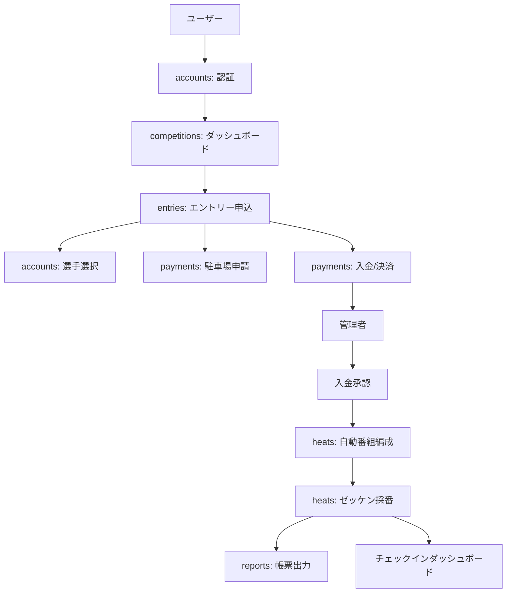

# Nit-Sys システム包括的ドキュメント (COMPREHENSIVE.md)

このドキュメントは、日本体育大学長距離競技会エントリー・運営管理システム (Nit-Sys) の全容を網羅した包括的なリファレンスです。
開発者、運用者、管理者がシステムの全体像から詳細な仕様までを把握するために作成されています。

---

## 1. プロジェクト概要 (README)

### 1.1 システム基本情報
- **システム名**: Nit-Sys (Nittai Track & Field System)
- **目的**: 日本体育大学長距離競技会のエントリー受付、入金管理、番組編成、帳票出力を一元管理し、運営業務の効率化と参加者の利便性向上を図る。
- **現在のバージョン**: v1.0.0 (実装完了率 約94%)

### 1.2 主要機能
| ユーザー（参加者）機能 | 管理者（運営）機能 |
|-------------------|-------------------|
| **アカウント管理**: 団体・個人登録、選手マスタ管理 | **大会管理**: 開催日、種目設定、エントリー期間設定 |
| **一括エントリー**: Excelインポート、複数選手登録 | **入金確認**: 振込明細照合、トラブル時強制承認 |
| **決済・駐車場**: 振込証明アップロード、駐車場希望申請 | **番組編成**: タイム順自動組分け、NCG自動スライド |
| **マイページ**: 駐車許可証DL、領収書DL、履歴確認 | **帳票出力**: プログラム・リザルト・点呼表PDF生成 |
| **情報収集**: ニュース閲覧、タイムテーブル確認 | **当日運営**: スマホでの当日点呼、結果入力 |

### 1.3 テクニカルスタック
| レイヤー | 技術 / バージョン | 詳細 |
|----------|------------------|------|
| **言語** | Python 3.10+ | |
| **フレームワーク** | Django 4.2+ | ハイブリッド構成 (MPA + Light Interactive) |
| **データベース** | PostgreSQL / SQLite | 本番はPostgreSQL、開発はSQLite |
| **フロントエンド** | Bootstrap 5.3.2 | Vanilla JS + CSS Variables |
| **管理画面** | Django Jazzmin | AdminLTEベースのモダンUI |
| **API** | DRF 3.14+ | 外部連携・フロントエンド用 |
| **PDF生成** | ReportLab | 帳票・許可証生成 |
| **非同期処理** | Gunicorn | WSGIサーバー |
| **インフラ** | Render / Railway | PaaSデプロイ前提 (render.yaml有) |

### 1.4 ローカル環境セットアップ
```bash
# 1. クローン
git clone https://github.com/nssu/nit-sys.git
cd nit-sys

# 2. 仮想環境
python -m venv venv
source venv/bin/activate

# 3. 依存関係
pip install -r requirements.txt

# 4. 環境変数設定 (.env.exampleをコピー)
cp .env.example .env
# 必要に応じて USE_SQLITE=True などを設定

# 5. DBマイグレーション & 初期データ
python manage.py migrate
python manage.py createsuperuser

# 6. 起動
python manage.py runserver
```

---

## 2. デザインシステム (DESIGN)

### 2.1 カラーパレット
`templates/base.html` で定義されたCSS変数に基づきます。日体大のブランドカラー（ブルー・ライオン）を基調としています。

| 変数名 | カラーコード | 用途 |
|--------|-------------|------|
| `--nit-primary` | `#1a365d` (Navy) | メインカラー、ヘッダー、主要ボタン |
| `--nit-secondary` | `#c53030` (Red) | アクセント、重要アクション、キャンセル |
| `--nit-accent` | `#2b6cb0` (Blue) | リンク、フォーカス、アクティブ状態 |
| `--nit-success` | `#38a169` (Green) | 成功通知、確定バッジ、承認アクション |
| `--nit-warning` | `#d69e2e` (Gold) | 注意喚起、保留ステータス |
| `--nit-light` | `#f7fafc` | 背景色、テーブルヘッダー |
| `--nit-dark` | `#1a202c` | テキスト基本色 |

### 2.2 タイポグラフィ
システムフォントを優先し、可読性とロード速度を重視。
```css
font-family: 'Helvetica Neue', Arial, 'Hiragino Kaku Gothic ProN', 'Hiragino Sans', Meiryo, sans-serif;
```

### 2.3 UIコンポーネント
- **ステータスバッジ**: 丸みを帯びたバッジ (`.status-badge`) で視認性を確保。
    - `confirmed`: 緑 (確定)
    - `pending`: 黄 (入金待ち)
    - `cancelled`: 赤 (キャンセル)
- **カード**: 影付きのカードデザイン (`.card`) で情報をグルーピング。
- **トースト通知**: 画面右上に動的に現れる通知 (`window.NitSys.toast()`)。
- **ショートカット**: `G`キー + `D`(Dashboard), `A`(Athletes) などで画面遷移可能なパワーツール。
- **ローディングボタン**: 送信時にスピナーを表示し、二重送信を防止 (`.is-loading`)。

---

## 3. アーキテクチャ (ARCHITECTURE)

### 3.1 ディレクトリ構造
```
nit-sys/
├── nitsys/                  # プロジェクト設定 (settings.py, urls.py)
├── accounts/                # ユーザー認証・団体・選手管理
├── competitions/            # 大会マスタ・種目・ダッシュボード
├── entries/                 # エントリー申込・グループ管理
├── payments/                # 決済処理・駐車場管理
├── heats/                   # 番組編成・リザルト・自動生成ロジック
├── reports/                 # 帳票出力・PDF生成エンジン
├── news/                    # お知らせ・CMS
├── templates/               # Django HTMLテンプレート (継承構造)
├── static/                  # CSS, JS, Images
└── scripts/                 # 管理用スクリプト
```

### 3.2 アプリケーション構成図


### 3.3 データフロー
1. **登録フェーズ**: ユーザーが選手（Details）を登録し、大会（Competition）の種目（Race）にエントリー（Entry）を作成。
2. **確定フェーズ**: 複数エントリーを `EntryGroup` にまとめ、合計金額を算出。ユーザーが振込明細画像をアップロード（Payment）。
3. **承認フェーズ**: 管理者が `Payment` を承認すると、紐づく `Entry` が全て `confirmed` になる。
4. **編成フェーズ**: 締切後、管理者が `HeatGenerator` を実行。申告タイム順に `Heat` と `HeatAssignment` が生成される。

---

## 4. コンテンツ管理 (CONTENT)

### 4.1 お知らせ管理 (News App)
管理者は管理画面からブログ形式でお知らせを投稿可能。
- **カテゴリ**: お知らせ (`info`)、重要 (`important`)、訂正 (`correction`)、緊急 (`urgent`)
- **機能**: 重要フラグを立てると、ダッシュボード上部で強調表示される。
- **台風等の緊急時**: 全ユーザーのトップページにアラートを表示する運用が可能。

### 4.2 リザルト・番組管理
- **番組編成**: `heats` アプリの管理画面でドラッグ＆ドロップ（または番号指定）での組移動が可能。
- **当日点呼**: スマホ対応の管理画面から、選手のチェックイン状態 (`checked_in`) をトグル可能。
- **結果入力**: 現状はCSVインポートまたは管理画面からの手入力（FinishLynx連携用のCSV出力機能あり）。

---

## 5. データ構造 (DATA)

### 5.1 主要ERモデル
**太字**は主要キーまたは外部キー関係。

#### User / Account (accounts)
- **User**: `email`, `organization_type` (大学/高校/実業団), `is_admin`, `is_individual`
- **Organization**: `name`, `jaaf_code` (陸連ID), `representative_name`
- **Athlete**: `full_name`, `gender`, `birth_date`, `jaaf_id`, `best_time`, `user_id` OR `organization_id`

#### Competition (competitions)
- **Competition**: `name`, `event_date`, `entry_start/end_at`, `is_published`
- **Race**: `distance` (5000m等), `gender`, `is_ncg` (NCGフラグ), `standard_time` (参加標準記録)

#### Entry (entries)
- **Entry**: `athlete_id`, `race_id`, `declared_time` (申告タイム), `status` (pending/confirmed/dns), `moved_from_ncg` (NCG漏れフラグ)
- **EntryGroup**: `entries` (M2M), `total_amount`, `is_draft`

#### Heat (heats)
- **Heat**: `race_id`, `heat_number`, `scheduled_start_time`
- **HeatAssignment**: `heat_id`, `entry_id`, `bib_number` (腰番), `race_bib_number` (ゼッケン), `checked_in`

### 5.2 特別なロジック (Business Logic)
- **NCGスライド**: `HeatGenerator.process_ncg_entries` により、NCG種目の定員漏れ選手を、自動的に指定された一般種目 (`fallback_race`) へ移動させ、`moved_from_ncg=True` を記録する。
- **ゼッケン自動採番**: `BibNumberGenerator` により、カテゴリ別（NCG男子:1~, 一般男子:1000~ 等）の範囲で機械的に番号を割り振る。

---

## 6. SEO設定 (SEO)

### 6.1 メタデータ
`templates/base.html` に共通設定を記述。各ページで `` を上書き。
```html
<title>Nit-Sys | 日体大記録会エントリーシステム</title>
<meta name="description" content="日体大長距離競技会エントリーシステム">
<meta name="theme-color" content="#1a365d">
```

### 6.2 構造化データ
現状は動的なJSON-LD生成は未実装だが、ニュース詳細ページ等でArticle構造化データの埋め込みを想定したブロックが用意されている。

---

## 7. デプロイ (DEPLOYMENT)

### 7.1 プラットフォーム
**Render.com** (PaaS) を主戦場として構成。
- **Web Service**: Gunicorn で Djangoを起動。
- **Database**: Managed PostgreSQL。

### 7.2 Render Blueprint (render.yaml)
IaCとして `render.yaml` がルートに存在。
- **Build**: `pip install -r requirements.txt`
- **Start**: `gunicorn nitsys.wsgi:application`
- **Env**: `PYTHON_VERSION=3.11.4`

### 7.3 環境変数 (Secrets)
Production環境で必須の設定。
- `SECRET_KEY`: Django暗号化キー
- `DATABASE_URL`: DB接続文字列
- `ALLOWED_HOSTS`: `.onrender.com` 等
- `SENTRY_DSN`: エラー監視用 (Sentry)
- `EMAIL_HOST_USER` / `PASSWORD`: メール配信用 (Gmail SMTP等)

### 7.4 CI/CD (GitHub Actions)
`.github/workflows/ci.yml` で定義。
- **Triggers**: `main`, `develop` へのPush/PR
- **Jobs**:
    1. **Test**: PostgreSQLサービスを立ち上げて `pytest` (カバレッジ計測)
    2. **Lint**: `ruff` によるコード規約チェック
    3. **Security**: `bandit` による脆弱性スキャン, `pip-audit` による依存パッケージチェック

---

## 8. 貢献ガイド (CONTRIBUTING)

### 8.1 ブランチ戦略
- **main**: 本番環境用 (Production Ready)
- **develop**: 開発用統合ブランチ
- **feature/***: 新機能開発用 (例: `feature/add-csv-export`)
- **fix/***: バグ修正用

### 8.2 開発フロー
1. Issueを立てて要件を定義。
2. `develop` からトピックブランチを作成。
3. コード実装 & テスト追加。
4. ローカルで `ruff check .` と `pytest` をパスすることを確認。
5. PRを作成し、CI (GitHub Actions) がオールグリーンになることを確認。
6. レビュー承認後、マージ。

### 8.3 コーディング規約
- **Style**: PEP 8準拠 (Ruffで強制)
- **Docstring**: Google Style で記述。モデルや複雑なロジックには必ず説明を書く。
- **Type Hinting**: 可能な限り型ヒントをつけることを推奨。

### 8.4 コミットメッセージ
Conventional Commitsに準拠することを推奨。
- `feat:`: 新機能
- `fix:`: バグ修正
- `docs:`: ドキュメントのみの変更
- `style:`: フォーマット修正
- `refactor:`: リファクタリング
